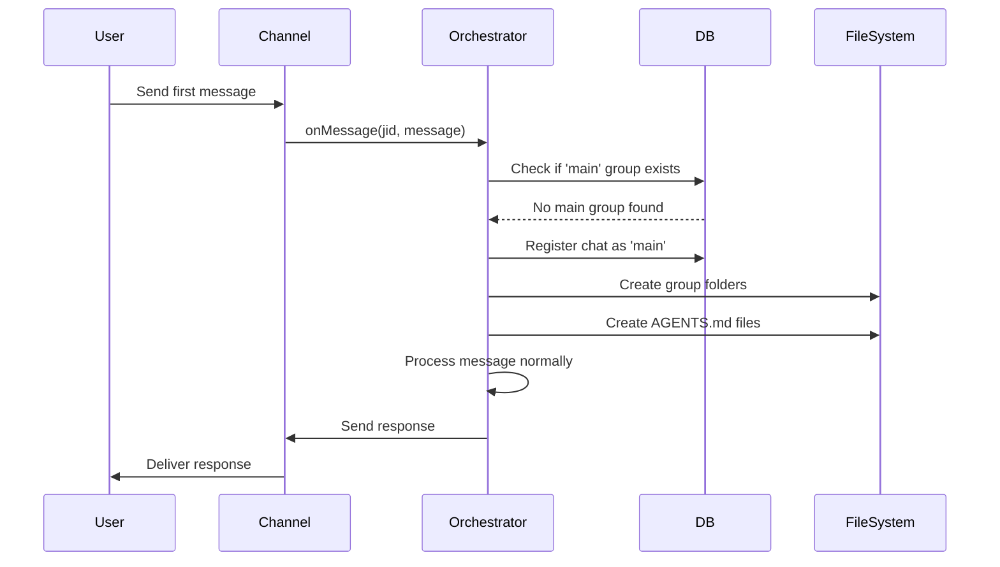

# Auto-Registration Feature Design

## Overview

This design implements automatic registration of the first chat as the 'main' group in NanoClaw, eliminating manual JID entry and configuration scripts. When a user sends their first message to the bot on any channel (Telegram, WhatsApp), the system automatically:

1. Detects that no 'main' group exists
2. Registers the chat as 'main' with appropriate settings
3. Creates the necessary folder structure and files
4. Processes the message immediately

The design is channel-agnostic, working through the existing Channel abstraction without requiring channel-specific code changes.

## Architecture

### High-Level Flow



### Integration Points

The auto-registration logic integrates into the existing message flow at a single point:

- **Location**: `src/index.ts` in the `main()` function, within the channel callback setup
- **Trigger**: When `onMessage` callback is invoked for an unregistered chat
- **Check**: Before storing the message, check if 'main' group exists
- **Action**: If no 'main' exists, auto-register the chat

This approach ensures:
- Minimal code changes (single integration point)
- Channel-agnostic implementation (works for all channels)
- No disruption to existing message processing flow

## Components and Interfaces

### 1. Auto-Registration Module

**Location**: `src/auto-registration.ts` (new file)

**Purpose**: Encapsulates all auto-registration logic in a single, testable module.

**Interface**:

```typescript
export interface AutoRegistrationResult {
  registered: boolean;
  reason: 'already_exists' | 'registered' | 'not_eligible';
}

/**
 * Attempt to auto-register a chat as the 'main' group.
 * 
 * @param chatJid - The JID of the chat attempting to register
 * @param chatName - The name of the chat (user name for private, group name for groups)
 * @param isPrivateChat - Whether this is a private/DM chat
 * @returns Result indicating whether registration occurred
 */
export function attemptAutoRegistration(
  chatJid: string,
  chatName: string,
  isPrivateChat: boolean
): AutoRegistrationResult;

/**
 * Check if the 'main' group already exists.
 * 
 * @returns true if main group is registered, false otherwise
 */
export function hasMainGroup(): boolean;

/**
 * Initialize the main group folder structure and files.
 * Creates:
 * - groups/main/
 * - groups/main/logs/
 * - groups/main/conversations/
 * - groups/main/AGENTS.md
 * - groups/global/AGENTS.md (if not exists)
 * 
 * @param groupFolder - The folder name (always 'main' for auto-registration)
 */
export function initializeGroupFolders(groupFolder: string): void;
```

### 2. Database Extensions

**Location**: `src/db.ts` (existing file, add new function)

**New Function**:

```typescript
/**
 * Check if a group with the specified folder name exists.
 * 
 * @param folder - The folder name to check (e.g., 'main')
 * @returns true if a group with this folder exists, false otherwise
 */
export function hasGroupWithFolder(folder: string): boolean;
```

**Implementation**:

```typescript
export function hasGroupWithFolder(folder: string): boolean {
  const row = db
    .prepare('SELECT 1 FROM registered_groups WHERE folder = ? LIMIT 1')
    .get(folder) as { 1: number } | undefined;
  return row !== undefined;
}
```

### 3. Orchestrator Integration

**Location**: `src/index.ts` (existing file, modify `main()` function)

**Changes**:

1. Import auto-registration module
2. Wrap `onMessage` callback with auto-registration check
3. Call `attemptAutoRegistration` before storing messages for unregistered chats

**Pseudocode**:

```
function main():
  // ... existing setup ...
  
  channelOpts = {
    onMessage: (chatJid, msg) => {
      // Check if chat is registered
      group = registeredGroups[chatJid]
      
      if not group:
        // Attempt auto-registration
        result = attemptAutoRegistration(chatJid, msg.sender_name, isPrivateChat)
        
        if result.registered:
          // Reload registered groups from DB
          registeredGroups = getAllRegisteredGroups()
          group = registeredGroups[chatJid]
          log("Auto-registered chat as main group")
      
      // Store message (existing logic)
      storeMessage(msg)
    },
    
    onChatMetadata: (chatJid, timestamp, name) => {
      // Existing logic unchanged
      storeChatMetadata(chatJid, timestamp, name)
    },
    
    registeredGroups: () => registeredGroups
  }
  
  // ... rest of existing code ...
```

## Data Models

### RegisteredGroup (existing)

No changes to the existing `RegisteredGroup` interface. Auto-registration uses the same structure:

```typescript
interface RegisteredGroup {
  name: string;           // Chat name (user name or group name)
  folder: string;         // Always 'main' for auto-registration
  trigger: string;        // Default trigger pattern from config
  added_at: string;       // ISO timestamp
  containerConfig?: ContainerConfig;
  requiresTrigger?: boolean;  // Set to false for main group
}
```

### Database Schema (existing)

No schema changes required. The `registered_groups` table already supports all necessary fields:

```sql
CREATE TABLE registered_groups (
  jid TEXT PRIMARY KEY,
  name TEXT NOT NULL,
  folder TEXT NOT NULL UNIQUE,
  trigger_pattern TEXT NOT NULL,
  added_at TEXT NOT NULL,
  container_config TEXT,
  requires_trigger INTEGER DEFAULT 1
);
```

### Auto-Registration Decision Logic

**Eligibility Criteria**:

1. No 'main' group exists in database (`hasGroupWithFolder('main')` returns false)
2. Chat is either:
   - A private/DM chat (preferred), OR
   - A group chat (acceptable if it's the first message)

**Registration Parameters**:

- `jid`: The chat's JID (e.g., `tg:123456` or `120363@g.us`)
- `name`: Chat name (sender name for private, group title for groups)
- `folder`: Always `'main'`
- `trigger`: Default trigger pattern from `TRIGGER_PATTERN` config
- `requiresTrigger`: Always `false` (main group doesn't need @mentions)
- `added_at`: Current ISO timestamp

## Folder Structure Initialization

### Directory Layout

```
groups/
├── main/
│   ├── logs/
│   ├── conversations/
│   └── AGENTS.md
└── global/
    └── AGENTS.md
```

### File Templates

**groups/main/AGENTS.md**:

```markdown
# Memory for Main Chat

This is your personal chat memory. You can store information here that you want to remember across conversations.

## About Me

[The agent can write information about you here]

## Preferences

[Your preferences and settings]

## Projects

[Information about your projects]
```

**groups/global/AGENTS.md** (if not exists):

```markdown
# Global Memory

This memory is shared across all groups. Store general knowledge and capabilities here.

## Available Skills

Skills are located in \`.opencode/skills/\`. To use a skill, read its SKILL.md file.

## Capabilities

- Web search and content fetching
- File reading and writing
- Code analysis and generation
- Task scheduling
- Multi-group management
```

### Initialization Timing

Folder initialization happens synchronously during auto-registration, before the message is processed. This ensures:

1. The group folder exists before the agent is invoked
2. AGENTS.md is available for the agent to read/write
3. No race conditions between folder creation and agent execution


## Correctness Properties

*A property is a characteristic or behavior that should hold true across all valid executions of a system—essentially, a formal statement about what the system should do. Properties serve as the bridge between human-readable specifications and machine-verifiable correctness guarantees.*

### Property 1: Auto-registration succeeds for first chat

*For any* chat (private or group) on any channel, when no 'main' group exists in the database, sending a message should result in that chat being registered as the 'main' group.

**Validates: Requirements 1.4, 4.1, 4.2**

### Property 2: Message processing continues after auto-registration

*For any* first message that triggers auto-registration, the system should process and respond to that message without requiring manual intervention.

**Validates: Requirements 1.5**

### Property 3: Folder structure is created during auto-registration

*For any* auto-registration event, the following folders and files should exist after registration completes:
- `groups/main/`
- `groups/main/logs/`
- `groups/main/conversations/`
- `groups/main/AGENTS.md`

**Validates: Requirements 1.6**

### Property 4: JID format is preserved

*For any* JID format (Telegram `tg:123456`, WhatsApp `120363@g.us`, etc.), auto-registration should store the exact JID string without modification.

**Validates: Requirements 2.2**

### Property 5: Auto-registration only when no main group exists

*For any* chat attempting auto-registration, registration should only succeed if querying the database for a group with folder='main' returns no results.

**Validates: Requirements 3.1**

### Property 6: Subsequent chats are not auto-registered

*For any* chat attempting auto-registration when a 'main' group already exists in the database, the registration should not occur and the chat should remain unregistered.

**Validates: Requirements 3.2**

### Property 7: Metadata is stored for all chats

*For any* chat that sends a message (registered or unregistered), the chat metadata (JID, name, timestamp) should be stored in the `chats` table.

**Validates: Requirements 3.3**

### Property 8: Chat name is set correctly

*For any* auto-registered chat, the name field should be set to the sender's name if it's a private chat, or the group title if it's a group chat.

**Validates: Requirements 4.3**

### Property 9: Main group does not require trigger

*For any* auto-registered main group, the `requiresTrigger` field should be set to `false`, allowing messages without @mentions to be processed.

**Validates: Requirements 4.4**

### Property 10: Main AGENTS.md is created with template

*For any* auto-registration event, the file `groups/main/AGENTS.md` should exist and contain the default template content for personal chat memory.

**Validates: Requirements 5.4**

### Property 11: Global AGENTS.md is created if missing

*For any* auto-registration event, if `groups/global/AGENTS.md` does not exist, it should be created with the default template content for global memory.

**Validates: Requirements 5.5**

## Error Handling

### Error Scenarios

1. **Database write failure during registration**
   - **Cause**: Database locked, disk full, or permission issues
   - **Handling**: Log error, do not mark chat as registered, allow retry on next message
   - **User Impact**: User sees no response, can retry by sending another message

2. **Folder creation failure**
   - **Cause**: Filesystem permissions, disk full, or path issues
   - **Handling**: Log error, rollback database registration, return error
   - **User Impact**: User sees no response, admin must fix filesystem issues

3. **Concurrent registration attempts**
   - **Cause**: Multiple messages arrive simultaneously before first registration completes
   - **Handling**: Database UNIQUE constraint on `folder` column prevents duplicates
   - **User Impact**: First registration succeeds, subsequent attempts are ignored (correct behavior)

4. **Invalid JID format**
   - **Cause**: Channel implementation bug or protocol change
   - **Handling**: Log warning, store JID as-is, proceed with registration
   - **User Impact**: Registration succeeds, but JID may not work correctly (channel bug)

### Error Recovery

**Idempotency**: Auto-registration is idempotent. If registration partially completes (e.g., folders created but database write fails), retrying will:
- Skip folder creation if folders already exist
- Retry database write
- Complete successfully

**Rollback Strategy**: If folder creation fails after database write:
1. Delete the registered_groups entry from database
2. Log error with full context
3. Return failure to allow retry

**Logging**: All auto-registration attempts (success and failure) are logged with:
- Chat JID
- Chat name
- Chat type (private/group)
- Timestamp
- Success/failure reason

## Testing Strategy

### Dual Testing Approach

This feature requires both unit tests and property-based tests for comprehensive coverage:

- **Unit tests**: Verify specific examples, edge cases, and error conditions
- **Property tests**: Verify universal properties across all inputs
- Together: Comprehensive coverage (unit tests catch concrete bugs, property tests verify general correctness)

### Property-Based Testing

**Library**: Use `fast-check` for TypeScript property-based testing

**Configuration**: Each property test should run minimum 100 iterations

**Test Tagging**: Each test must reference its design document property:
```typescript
// Feature: auto-registration, Property 1: Auto-registration succeeds for first chat
```

**Property Test Coverage**:

1. **Property 1**: Generate random JIDs and chat names, verify registration succeeds when no main exists
2. **Property 2**: Generate random messages, verify they are processed after auto-registration
3. **Property 3**: Verify folder structure exists after any auto-registration
4. **Property 4**: Generate random JID formats, verify exact preservation
5. **Property 5**: Verify registration only succeeds when `hasGroupWithFolder('main')` returns false
6. **Property 6**: Verify registration fails when main group already exists
7. **Property 7**: Generate random chat metadata, verify storage in database
8. **Property 8**: Generate random private/group chats, verify name field correctness
9. **Property 9**: Verify `requiresTrigger` is false for all auto-registered groups
10. **Property 10**: Verify main AGENTS.md exists with correct content
11. **Property 11**: Verify global AGENTS.md is created when missing

### Unit Testing

**Focus Areas**:

1. **Specific Examples**:
   - Telegram private chat auto-registration
   - WhatsApp group chat auto-registration
   - Second message after auto-registration (should not re-register)

2. **Edge Cases**:
   - Empty chat name (should use JID as fallback)
   - Very long chat names (should be stored as-is)
   - Special characters in chat names (should be preserved)
   - Concurrent registration attempts (database constraint prevents duplicates)

3. **Error Conditions**:
   - Database write failure (should rollback and allow retry)
   - Folder creation failure (should rollback database write)
   - Missing parent directories (should create recursively)

4. **Integration Points**:
   - Channel callback integration (verify onMessage triggers auto-registration)
   - Message processing flow (verify message is processed after registration)
   - Existing manual registration (verify it still works)

### Test Environment

**Database**: Use in-memory SQLite database for tests (via `_initTestDatabase()`)

**Filesystem**: Use temporary directories for folder creation tests

**Mocking**: Mock channel implementations to test orchestrator integration

### Backward Compatibility Testing

Verify that existing functionality is not broken:

1. Manual registration via `register-chat.js` still works
2. Manual registration via IPC commands still works
3. Existing registered groups continue to function
4. Message processing for registered groups is unchanged
5. Group metadata sync is unchanged

## Implementation Notes

### Race Condition Prevention

The database UNIQUE constraint on the `folder` column in `registered_groups` table prevents race conditions:

```sql
CREATE TABLE registered_groups (
  jid TEXT PRIMARY KEY,
  folder TEXT NOT NULL UNIQUE,  -- UNIQUE prevents duplicate 'main' groups
  ...
);
```

If two messages arrive simultaneously and both attempt to register as 'main':
1. First INSERT succeeds
2. Second INSERT fails with UNIQUE constraint violation
3. Second attempt sees main group exists, skips registration
4. Both messages are processed normally

### Performance Considerations

**Database Query**: The `hasGroupWithFolder('main')` check adds one SELECT query per message from unregistered chats. This is acceptable because:
- Query is indexed (UNIQUE constraint creates index)
- Only runs for unregistered chats (not on every message)
- Once main is registered, unregistered chats are rare

**Folder Creation**: Synchronous filesystem operations during registration add ~10-50ms latency. This is acceptable because:
- Only happens once (first message)
- User expects slight delay on first interaction
- Subsequent messages have no filesystem overhead

### Security Considerations

**First-Come-First-Served**: The first chat to send a message becomes 'main'. This is acceptable for personal use but has implications:

- **Threat**: Attacker sends message before legitimate user
- **Mitigation**: User must secure their bot token (don't share publicly)
- **Future**: Pairing system (out of scope for this spec)

**No Authorization Check**: Auto-registration does not verify user identity. This is acceptable because:
- Bot token is secret (only legitimate user has it)
- Messaging platforms handle authentication
- Main group is for personal use (single user)

### Migration from Manual Registration

Users who already have a manually registered 'main' group:
- Auto-registration will not trigger (main already exists)
- No changes to existing setup
- No migration needed

Users who have not registered any groups:
- Auto-registration will trigger on first message
- Equivalent to running `register-chat.js` manually
- Simpler user experience
