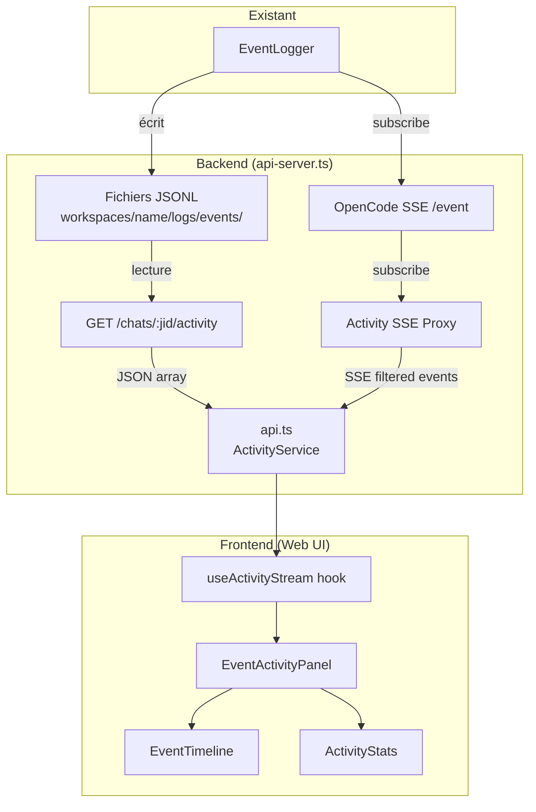

# Document de Design — Event Activity Panel

## Vue d'ensemble

Le Event Activity Panel est un système bout-en-bout qui expose les événements granulaires d'OpenCode (outils appelés, fichiers édités, commandes exécutées, erreurs, etc.) au Web UI d'EureClaw. Il se compose de trois couches :

1. **API Backend** — Deux nouveaux groupes de routes dans `api-server.ts` : un endpoint REST pour l'historique JSONL et un endpoint SSE pour le streaming temps réel des événements d'activité.
2. **Service Client** — Extensions de `api.ts` et un nouveau hook React pour consommer les endpoints REST et SSE.
3. **Composants React** — Un panneau `EventActivityPanel` intégré dans la vue de chat, affichant une timeline verticale d'événements et un résumé statistique.

Le flux de données est : `EventLogger (JSONL) → API REST/SSE → React Components`.

Le design réutilise les patterns existants : authentification Bearer, SSE comme `/chat/stream`, composants timeline comme `ActivityView`, et le thème clair/sombre via `isDark`.

## Architecture



### Décisions d'architecture

1. **Nouveau endpoint SSE dédié** (`/chats/:jid/activity/stream`) plutôt qu'étendre `/chat/stream` — séparation des responsabilités : le stream de chat transmet les deltas texte, le stream d'activité transmet les événements structurés. Cela évite de surcharger le stream existant et permet une connexion/déconnexion indépendante.

2. **Filtrage côté serveur** — Les événements bruyants (`message.part.delta`, `file.watcher.updated`, `tui.*`, etc.) sont filtrés sur le serveur pour réduire la bande passante. Le client reçoit uniquement les événements significatifs.

3. **Routes dans un fichier séparé** — Pour respecter la limite de 600 lignes, les routes d'activité seront dans `src/api-activity-routes.ts`, enregistrées via `registerActivityRoutes(fastify, authenticate)` comme les autres modules de routes.

4. **Pas de base de données** — Les fichiers JSONL existants sont la source de vérité. Pas besoin de dupliquer dans SQLite.

## Composants et Interfaces

### Backend — `src/api-activity-routes.ts`

```typescript
// Routes enregistrées via registerActivityRoutes(fastify, authenticate)

// 1. Liste des fichiers JSONL disponibles
GET /chats/:jid/activity
→ { files: Array<{ filename: string, size: number, modified: string }> }

// 2. Contenu d'un fichier JSONL spécifique
GET /chats/:jid/activity/:filename
  ?limit=100    // nombre max d'événements
  ?since=17751  // timestamp minimum (ms)
→ { events: ActivityEvent[] }

// 3. Stream SSE temps réel
GET /chats/:jid/activity/stream
→ SSE: data: { type: string, ts: number, properties: object, chatJid: string, folder: string }
```

### Types partagés — `ActivityEvent`

```typescript
interface ActivityEvent {
  ts: number;           // timestamp Unix ms
  type: string;         // type d'événement OpenCode
  properties: Record<string, unknown>;
  // Champs enrichis par le serveur :
  icon?: string;        // emoji du EVENT_ICONS mapping
  label?: string;       // description lisible (ex: "Reading: src/index.ts")
  category?: 'session' | 'tool' | 'file' | 'command' | 'error' | 'message' | 'other';
}
```

### Frontend — Composants React

| Composant | Responsabilité |
|-----------|---------------|
| `EventActivityPanel` | Conteneur principal, gère la connexion SSE et l'état |
| `EventTimeline` | Timeline verticale chronologique des événements |
| `EventTimelineItem` | Ligne individuelle d'événement avec icône, label, timestamp |
| `ActivityStats` | Panneau de statistiques récapitulatives (compteurs, badges outils) |

### Frontend — Hook `useActivityStream`

```typescript
function useActivityStream(jid: string | null, enabled: boolean): {
  events: ActivityEvent[];
  stats: ActivityStatsData;
  isConnected: boolean;
  isLoading: boolean;
  error: string | null;
  loadHistory: (filename: string) => Promise<void>;
  availableFiles: ActivityFile[];
}
```

### Frontend — Extensions `api.ts`

```typescript
// Nouvelles méthodes sur ApiService
getActivityFiles(jid: string): Promise<ActivityFile[]>
getActivityEvents(jid: string, filename: string, options?: { limit?: number, since?: number }): Promise<ActivityEvent[]>
connectToActivityStream(jid: string): void
disconnectFromActivityStream(): void
onActivityEvent(callback: (event: ActivityEvent) => void): () => void
```

## Modèles de données

### Format JSONL existant (source de vérité)

Chaque ligne du fichier JSONL est un objet JSON :
```json
{"ts": 1775151686297, "type": "server.connected", "properties": {}}
{"ts": 1775151686469, "type": "message.updated", "properties": {"info": {"id": "msg_...", "sessionID": "ses_...", "role": "user", "agent": "orchestrator", "model": {"providerID": "opencode", "modelID": "big-pickle"}}}}
```

La dernière ligne peut être un résumé `_summary` :
```json
{"ts": 1775151700000, "type": "_summary", "properties": {"duration": 45, "totalEvents": 120, "toolsUsed": ["read", "write", "bash"], "filesEdited": ["src/index.ts"], "commandsRun": 3, "errors": 0, "byType": {"message.part.updated": 50}}}
```

### ActivityEvent normalisé (envoyé au client)

```typescript
interface ActivityEvent {
  ts: number;
  type: string;
  properties: Record<string, unknown>;
  icon: string;
  label: string;
  category: 'session' | 'tool' | 'file' | 'command' | 'error' | 'message' | 'other';
}
```

### ActivityStatsData (calculé côté client)

```typescript
interface ActivityStatsData {
  totalEvents: number;
  duration: number;          // secondes
  filesEdited: string[];
  commandsRun: number;
  errors: number;
  toolsUsed: Map<string, number>;  // toolName → count
  isActive: boolean;         // entre session.created et session.idle
}
```

### ActivityFile (liste des fichiers JSONL)

```typescript
interface ActivityFile {
  filename: string;
  size: number;
  modified: string;  // ISO timestamp
}
```

### Mapping des types d'événements filtrés

**Transmis au client (événements significatifs) :**
- `session.created`, `session.idle`, `session.error`, `session.compacted`
- `message.part.updated` (uniquement `tool-invocation`)
- `message.updated` (uniquement `role: assistant`)
- `file.edited`, `vcs.branch.updated`
- `command.executed`, `pty.created`, `pty.exited`
- `question.asked`, `question.replied`, `question.rejected`
- `permission.asked`, `permission.replied`
- `mcp.tools.changed`, `lsp.client.diagnostics`
- `todo.updated`

**Filtrés côté serveur (bruyants) :**
- `message.part.delta` (streaming texte — déjà dans `/chat/stream`)
- `file.watcher.updated`, `pty.updated`
- `tui.*`, `installation.*`, `server.*`, `global.*`
- `lsp.updated`, `session.status`, `session.diff`
- `workspace.*`, `worktree.*`, `project.updated`

### Mapping catégories et icônes

Le mapping réutilise `EVENT_ICONS` de `event-logger.ts` :

| Catégorie | Types | Icône |
|-----------|-------|-------|
| `session` | `session.created`, `session.idle`, `session.compacted` | 🟢 💤 📦 |
| `error` | `session.error` | 🔴 |
| `tool` | `message.part.updated` (tool-invocation) | 📖 ✍️ ✏️ 🖥️ 🔎 🌐 🤖 🔧 |
| `file` | `file.edited`, `vcs.branch.updated` | 📄 🌿 |
| `command` | `command.executed`, `pty.created`, `pty.exited` | ⚙️ 🖥️ |
| `message` | `message.updated` (assistant), `question.*`, `permission.*` | 💬 ❓ ✅ 🔐 |
| `other` | `mcp.tools.changed`, `lsp.client.diagnostics`, `todo.updated` | 🔧 🔍 ☑️ |


## Propriétés de Correction (Correctness Properties)

*Une propriété est une caractéristique ou un comportement qui doit rester vrai pour toutes les exécutions valides d'un système — essentiellement, une déclaration formelle sur ce que le système doit faire. Les propriétés servent de pont entre les spécifications lisibles par l'humain et les garanties de correction vérifiables par la machine.*

### Property 1: Round-trip JSONL parsing

*For any* valid ActivityEvent object, serializing it to a JSONL line (JSON.stringify) then parsing it back (JSON.parse) should produce an object equivalent to the original.

**Validates: Requirements 1.2, 6.1, 6.4**

### Property 2: Malformed JSONL resilience

*For any* JSONL content containing a mix of valid JSON lines and invalid/malformed lines, the parser should return exactly the valid lines (in order) and silently skip the malformed ones. The count of returned events should equal the count of valid lines in the input.

**Validates: Requirements 6.2**

### Property 3: Event type filtering

*For any* OpenCode event, it should be transmitted to the client if and only if its type belongs to the allowed set (session lifecycle, tool-invocations, file.edited, command.executed, questions, permissions, etc.). Events in the filtered set (message.part.delta, file.watcher.updated, tui.*, installation.*, server.*, global.*, etc.) should never be transmitted.

**Validates: Requirements 2.3, 2.4**

### Property 4: Event enrichment with workspace context

*For any* event transmitted via the SSE activity stream, the event object should contain non-empty `chatJid` and `folder` fields corresponding to the workspace associated with the requested JID.

**Validates: Requirements 2.7**

### Property 5: Session-based event filtering

*For any* event received from the OpenCode SSE stream, it should only be forwarded to a client connected for JID X if the event's sessionID resolves to a workspace folder matching JID X's workspace folder. Events belonging to other sessions/workspaces should not be forwarded.

**Validates: Requirements 2.2**

### Property 6: Event label extraction

*For any* ActivityEvent, the normalization function should produce a `label` string that contains the relevant information from the event's properties:
- For `message.part.updated` (tool-invocation): the tool name (extracted from `part.toolInvocation.toolName` or `part.toolName`) and relevant arguments (filePath, command, url, pattern, agent)
- For `session.created`: the agent name and model ID
- For `file.edited`: the file path
- For `command.executed`: the command string (truncated to 120 characters with ellipsis if longer)

**Validates: Requirements 3.2, 3.3, 3.6, 3.7, 6.3, 6.5**

### Property 7: Icon mapping consistency

*For any* event type present in the EVENT_ICONS mapping, the normalization function should assign the corresponding icon. For unknown event types, a default icon should be assigned.

**Validates: Requirements 3.8**

### Property 8: MCP tool name cleaning

*For any* tool name starting with `mcp__eureclaw__`, the cleaning function should remove that prefix. For tool names starting with `mcp__` but not `mcp__eureclaw__`, only `mcp__` should be removed. For tool names not starting with `mcp__`, the name should remain unchanged.

**Validates: Requirements 6.6**

### Property 9: Stats computation from events

*For any* list of ActivityEvents, the stats computation function should produce:
- `totalEvents` equal to the length of the list
- `filesEdited` containing exactly the unique file paths from `file.edited` events
- `commandsRun` equal to the count of `command.executed` events
- `errors` equal to the count of `session.error` events
- `toolsUsed` map where each key is a tool name from tool-invocation events and each value is the count of `call` state invocations for that tool

**Validates: Requirements 4.1, 4.4**

### Property 10: Limit parameter caps results

*For any* JSONL file containing N events and any limit value L > 0, the API should return at most min(N, L) events.

**Validates: Requirements 1.3**

### Property 11: Since parameter filters by timestamp

*For any* JSONL file and any timestamp value T, all events returned by the API with `since=T` should have `ts > T`. No event with `ts <= T` should be present in the result.

**Validates: Requirements 1.4**

### Property 12: Authentication required

*For any* activity endpoint (GET /chats/:jid/activity, GET /chats/:jid/activity/:filename, GET /chats/:jid/activity/stream), a request without a valid Bearer token should receive a 401 HTTP response.

**Validates: Requirements 1.7**

## Gestion des erreurs

| Scénario | Comportement |
|----------|-------------|
| JID non enregistré | HTTP 404 `{ error: "Workspace not found for this chat" }` |
| Fichier JSONL inexistant | HTTP 404 `{ error: "Event file not found" }` |
| Dossier `logs/events/` vide ou absent | HTTP 200 `{ files: [] }` ou `{ events: [] }` |
| Ligne JSONL malformée | Ignorée silencieusement, parsing continue |
| Connexion OpenCode SSE échoue | SSE envoie `data: {"type":"error","message":"..."}` puis ferme le flux |
| Client ferme la connexion SSE | AbortController annule la connexion upstream, ressources libérées |
| Token Bearer manquant/invalide | HTTP 401 `{ error: "Missing or invalid authorization header" }` |
| Fichier JSONL trop volumineux | Le paramètre `limit` permet de paginer ; par défaut, retourne les 500 derniers événements |
| Erreur de lecture fichier | HTTP 500 `{ error: "Failed to read event file" }` avec log serveur |

## Stratégie de tests

### Approche duale

La stratégie de test combine des tests unitaires et des tests basés sur les propriétés (property-based testing) pour une couverture complète.

### Tests unitaires

Les tests unitaires couvrent les cas spécifiques, les edge cases et les intégrations :

- **Endpoint REST** : requête avec JID valide retourne les fichiers, JID invalide retourne 404, dossier vide retourne tableau vide
- **Endpoint SSE** : connexion établie avec headers SSE corrects, événement d'erreur envoyé si OpenCode indisponible
- **Parsing JSONL** : fichier vide, fichier avec une seule ligne, fichier avec résumé `_summary`
- **Intégration UI** : le panneau s'affiche quand activé, se masque quand désactivé, change de workspace correctement

### Tests basés sur les propriétés (Property-Based Testing)

Bibliothèque : **fast-check** (TypeScript/JavaScript)

Chaque propriété du document de design est implémentée comme un test property-based avec minimum 100 itérations. Chaque test est annoté avec un commentaire référençant la propriété :

```typescript
// Feature: event-activity-panel, Property 1: Round-trip JSONL parsing
fc.assert(fc.property(
  arbitraryActivityEvent(),
  (event) => {
    const line = JSON.stringify(event);
    const parsed = JSON.parse(line);
    expect(parsed).toEqual(event);
  }
), { numRuns: 100 });
```

Format de tag : **Feature: event-activity-panel, Property {number}: {property_text}**

Les propriétés à implémenter :
1. Round-trip JSONL parsing
2. Malformed JSONL resilience
3. Event type filtering
4. Event enrichment with workspace context
5. Session-based event filtering
6. Event label extraction
7. Icon mapping consistency
8. MCP tool name cleaning
9. Stats computation from events
10. Limit parameter caps results
11. Since parameter filters by timestamp
12. Authentication required

### Configuration

- Bibliothèque PBT : `fast-check`
- Minimum 100 itérations par test de propriété
- Générateurs personnalisés pour `ActivityEvent`, lignes JSONL valides/invalides, noms d'outils MCP
- Les tests unitaires utilisent `vitest` (cohérent avec le projet existant ou `bun:test`)
