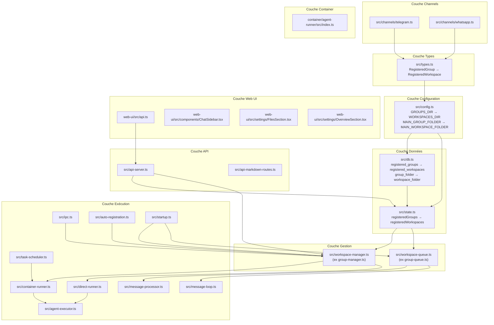

# Design Technique — Renommage `groups/` → `workspaces/`

## Vue d'ensemble

Ce document décrit la conception technique du refactoring massif renommant le concept "group" en "workspace" à travers tout le projet EureClaw. Le renommage touche ~30 fichiers TypeScript (backend + agent-runner), ~15 fichiers Web UI (React/TSX), 6 fichiers de test, la base de données SQLite, la documentation, les templates DNA, les skills, les prompts, les agents et les fichiers steering.

Le refactoring est purement terminologique : aucune logique métier ne change. L'objectif est d'aligner le vocabulaire du code avec le concept de "workspace" (contexte isolé d'un agent) plutôt que "group" (hérité de WhatsApp).

### Contrainte critique

Le sous-dossier `workspace/` (singulier) à l'intérieur de chaque workspace contient le contenu généré par l'agent (screenshots, reports, tasks, downloads). Ce dossier **NE DOIT PAS** être renommé. Seul le dossier racine `groups/` → `workspaces/` et les références dans le code sont concernés.

### Stratégie de renommage

Le refactoring suit un ordre bottom-up pour minimiser les erreurs de compilation intermédiaires :

1. **Types et interfaces** (`src/types.ts`) — fondation
2. **Configuration** (`src/config.ts`) — constantes de chemin
3. **Base de données** (`src/db.ts`) — schéma + migration
4. **Modules de gestion** (state, workspace-manager, workspace-queue)
5. **Modules consommateurs** (container-runner, direct-runner, ipc, task-scheduler, etc.)
6. **Channels** (telegram, whatsapp)
7. **API Server et routes**
8. **Web UI**
9. **Agent Runner** (container)
10. **Documentation, templates, skills, prompts, steering**
11. **Tests**

## Architecture

Le diagramme suivant montre les modules impactés et leurs dépendances :



## Composants et Interfaces

### 1. Types (`src/types.ts`)

**Changements :**

```typescript
// AVANT
export interface RegisteredGroup {
  name: string;
  folder: string;
  trigger: string;
  added_at: string;
  containerConfig?: ContainerConfig;
  requiresTrigger?: boolean; // Default: true for groups, false for solo chats
}

export interface ScheduledTask {
  // ...
  group_folder: string;
  context_mode: 'group' | 'isolated';
}

// APRÈS
export interface RegisteredWorkspace {
  name: string;
  folder: string;
  trigger: string;
  added_at: string;
  containerConfig?: ContainerConfig;
  requiresTrigger?: boolean; // Default: true for workspaces, false for solo chats
}

export interface ScheduledTask {
  // ...
  workspace_folder: string;
  context_mode: 'workspace' | 'isolated';
}
```

Le type `RegisteredGroup` est exporté et utilisé dans ~20 fichiers. Un alias temporaire `type RegisteredGroup = RegisteredWorkspace` peut être envisagé pour faciliter la migration incrémentale, mais la stratégie retenue est un renommage atomique via l'IDE (rename symbol).

### 2. Configuration (`src/config.ts`)

```typescript
// AVANT
export const GROUPS_DIR = path.resolve(PROJECT_ROOT, 'groups');
export const MAIN_GROUP_FOLDER = 'main';

// APRÈS
export const WORKSPACES_DIR = path.resolve(PROJECT_ROOT, 'workspaces');
export const MAIN_WORKSPACE_FOLDER = 'main';
```

### 3. Base de données (`src/db.ts`)

**Migration SQLite :**

SQLite ne supporte pas `ALTER TABLE RENAME COLUMN` avant la version 3.25.0. La stratégie utilise `ALTER TABLE RENAME TO` + `CREATE TABLE` + `INSERT INTO ... SELECT` pour garantir la compatibilité.

```sql
-- Migration registered_groups → registered_workspaces
ALTER TABLE registered_groups RENAME TO registered_workspaces;

-- Migration sessions: group_folder → workspace_folder
CREATE TABLE sessions_new (
  workspace_folder TEXT PRIMARY KEY,
  session_id TEXT NOT NULL,
  model TEXT
);
INSERT INTO sessions_new SELECT group_folder, session_id, model FROM sessions;
DROP TABLE sessions;
ALTER TABLE sessions_new RENAME TO sessions;

-- Migration scheduled_tasks: group_folder → workspace_folder
-- (même pattern CREATE/INSERT/DROP/RENAME)
```

La migration est exécutée automatiquement au démarrage dans `initDatabase()`, protégée par un try/catch. Si la table `registered_workspaces` existe déjà, la migration est ignorée (idempotente).

**Fonctions renommées :**
- `getRegisteredGroup` → `getRegisteredWorkspace`
- `setRegisteredGroup` → `setRegisteredWorkspace`
- `getAllRegisteredGroups` → `getAllRegisteredWorkspaces`
- `hasGroupWithFolder` → `hasWorkspaceWithFolder`
- `getTasksForGroup` → `getTasksForWorkspace`

### 4. Workspace Manager (`src/workspace-manager.ts`, ex `group-manager.ts`)

**Fichier renommé.** Fonctions renommées :
- `registerGroup` → `registerWorkspace`
- `copyTemplatesToGroup` → `copyTemplatesToWorkspace`
- `getAvailableGroups` → `getAvailableWorkspaces`

Les chemins internes utilisent `WORKSPACES_DIR` au lieu de `GROUPS_DIR`.

### 5. Workspace Queue (`src/workspace-queue.ts`, ex `group-queue.ts`)

**Fichier renommé.** Classe renommée :
- `GroupQueue` → `WorkspaceQueue`

Variables internes `groupJid` → `workspaceJid`, `groupFolder` → `workspaceFolder`, etc.

### 6. State Module (`src/state.ts`)

- `registeredGroups` → `registeredWorkspaces`
- `getRegisteredGroups` → `getRegisteredWorkspaces`
- `reloadRegisteredGroups` → `reloadRegisteredWorkspaces`
- `_setRegisteredGroups` → `_setRegisteredWorkspaces`
- `setGroupSession` → `setWorkspaceSession`

### 7. Container Runner (`src/container-runner.ts`)

- `GROUPS_DIR` → `WORKSPACES_DIR` dans les chemins de montage host
- `AvailableGroup` → `AvailableWorkspace`
- `writeGroupsSnapshot` → `writeWorkspacesSnapshot`
- Variables locales `group` → `workspace` dans les fonctions de montage

**Point critique :** Les chemins de montage container (`/workspace/group`, `/workspace/global`) restent **inchangés** pour ne pas casser l'agent-runner qui s'exécute dans le container avec ces chemins hardcodés.

### 8. IPC Module (`src/ipc.ts`)

- Interface `IpcDeps` : `registeredGroups` → `registeredWorkspaces`, `getAvailableGroups` → `getAvailableWorkspaces`, etc.
- Types IPC : `register_group` → `register_workspace`, `refresh_groups` → `refresh_workspaces`
- Variable `sourceGroup` → `sourceWorkspace`

### 9. Agent Runner (`container/agent-runner/src/index.ts`)

- `groupFolder` → `workspaceFolder` dans `ContainerInput`
- `groupDir` → `workspaceDir` dans `directMode`
- Variables locales et commentaires mis à jour
- Les hints de chemin référencent `workspaces/` au lieu de `groups/`

### 10. Web UI

- `web-ui/src/api.ts` : `RegisteredGroup` → `RegisteredWorkspace`, `groupInfo` → `workspaceInfo`
- `ChatSidebar.tsx` : label "Workspaces / Groups" → "Workspaces"
- `OverviewSection.tsx` : label "Groups" → "Workspaces", `registeredGroups` → `registeredWorkspaces`
- `FilesSection.tsx` : variables et commentaires mis à jour

### 11. API Server (`src/api-server.ts`)

- Routes `/groups` → conservées pour rétrocompatibilité OU renommées en `/workspaces`
- Champs JSON : `groupInfo` → `workspaceInfo`, `registeredGroups` → `registeredWorkspaces`
- Fonction `ensureWebGroupsRegistered` → `ensureWebWorkspacesRegistered`

**Décision de design :** Les endpoints API sont renommés (`/groups` → `/workspaces`) car la Web UI est le seul client et sera mise à jour simultanément. Pas de rétrocompatibilité nécessaire.

## Modèles de données

### Schéma SQLite (après migration)

```sql
CREATE TABLE registered_workspaces (
  jid TEXT PRIMARY KEY,
  name TEXT NOT NULL,
  folder TEXT NOT NULL,
  trigger_pattern TEXT NOT NULL,
  added_at TEXT NOT NULL,
  container_config TEXT,
  requires_trigger INTEGER DEFAULT 1
);

CREATE TABLE sessions (
  workspace_folder TEXT PRIMARY KEY,
  session_id TEXT NOT NULL,
  model TEXT
);

CREATE TABLE scheduled_tasks (
  id TEXT PRIMARY KEY,
  workspace_folder TEXT NOT NULL,
  chat_jid TEXT NOT NULL,
  prompt TEXT NOT NULL,
  schedule_type TEXT NOT NULL,
  schedule_value TEXT NOT NULL,
  next_run TEXT,
  last_run TEXT,
  last_result TEXT,
  status TEXT DEFAULT 'active',
  created_at TEXT NOT NULL,
  context_mode TEXT DEFAULT 'isolated'
);
```

### Structure du dossier (après renommage)

```
workspaces/
├── global/
│   └── memory/
│       ├── AGENTS.md
│       ├── DOCUMENTATION.md
│       ├── SECURITY.md
│       └── ...
├── main/
│   ├── memory/
│   ├── workspace/          ← NE PAS RENOMMER (singulier)
│   │   ├── screenshots/
│   │   ├── reports/
│   │   ├── tasks/
│   │   └── downloads/
│   ├── uploads/
│   ├── logs/
│   └── conversations/
├── templates/
│   ├── AGENTS.tpl.md
│   ├── IDENTITY.tpl.md
│   └── ...
└── {other-workspace}/
    ├── memory/
    ├── workspace/          ← NE PAS RENOMMER (singulier)
    └── ...
```

### Interface TypeScript principale (après renommage)

```typescript
export interface RegisteredWorkspace {
  name: string;
  folder: string;
  trigger: string;
  added_at: string;
  containerConfig?: ContainerConfig;
  requiresTrigger?: boolean;
}

export interface ContainerInput {
  prompt: string;
  sessionId?: string;
  workspaceFolder: string;    // ex groupFolder
  chatJid: string;
  isMain: boolean;
  isScheduledTask?: boolean;
  forceNewSession?: boolean;
  secrets?: Record<string, string>;
  model?: string;
  agent?: string;
  directMode?: {
    ipcDir: string;
    workspaceDir: string;     // ex groupDir
    globalDir?: string;
    projectDir?: string;
  };
}

export interface AvailableWorkspace {
  jid: string;
  name: string;
  lastActivity: string;
  isRegistered: boolean;
}
```


## Propriétés de Correction

*Une propriété est une caractéristique ou un comportement qui doit rester vrai à travers toutes les exécutions valides d'un système — essentiellement, une déclaration formelle sur ce que le système doit faire. Les propriétés servent de pont entre les spécifications lisibles par l'humain et les garanties de correction vérifiables par la machine.*

### Propriété 1 : Round-trip de migration SQLite

*Pour toute* base de données SQLite contenant des données dans les tables `registered_groups`, `sessions` (avec colonne `group_folder`) et `scheduled_tasks` (avec colonne `group_folder`), l'exécution de la migration doit produire des tables `registered_workspaces`, `sessions` (avec colonne `workspace_folder`) et `scheduled_tasks` (avec colonne `workspace_folder`) contenant exactement les mêmes données (nombre de lignes et valeurs identiques).

**Validates: Requirements 4.1, 4.2, 4.3, 4.4**

### Propriété 2 : Préservation du sous-dossier workspace/ interne

*Pour tout* workspace créé via `registerWorkspace()`, le sous-dossier de contenu généré doit être nommé `workspace/` (singulier) et non `workspaces/` (pluriel). Le chemin résultant doit être `workspaces/{name}/workspace/`.

**Validates: Requirements 1.3, 21.1**

### Propriété 3 : Invariance des chemins de montage container

*Pour tout* workspace (main ou non-main), les chemins de montage côté container générés par `buildVolumeMounts()` doivent contenir `/workspace/group` et `/workspace/global` (inchangés), même si les chemins côté host utilisent `workspaces/` au lieu de `groups/`.

**Validates: Requirements 8.5**

### Propriété 4 : Compatibilité du protocole ContainerInput

*Pour tout* objet `ContainerInput` sérialisé par le host (container-runner ou direct-runner), le champ `workspaceFolder` doit être correctement désérialisé par l'agent-runner. Autrement dit, `JSON.parse(JSON.stringify(input)).workspaceFolder` doit être égal à `input.workspaceFolder`.

**Validates: Requirements 12.1, 12.2**

## Gestion des erreurs

### Migration SQLite

- Si la table `registered_workspaces` existe déjà → la migration est ignorée (idempotente)
- Si `ALTER TABLE RENAME TO` échoue → l'erreur est loggée, les données existantes restent intactes dans les anciennes tables
- Si la migration des colonnes échoue (CREATE/INSERT/DROP) → transaction rollback, les anciennes tables sont préservées

### Compilation

- Chaque étape du refactoring est suivie d'un `bun run build` pour détecter les erreurs de compilation
- Les erreurs de type (import manquant, type incompatible) sont corrigées avant de passer à l'étape suivante

### Chemins de fichiers

- Si `workspaces/` n'existe pas au démarrage → il est créé automatiquement (comme `groups/` l'était)
- Si un workspace référence un chemin avec l'ancien nom `groups/` → le code utilise `WORKSPACES_DIR` qui pointe vers le bon dossier

### Rétrocompatibilité

- Les endpoints API sont renommés (`/groups` → `/workspaces`) — la Web UI est mise à jour simultanément
- Les types IPC (`register_group` → `register_workspace`) sont mis à jour dans le host ET l'agent-runner simultanément
- La valeur `context_mode: 'group'` dans les tâches existantes est migrée vers `context_mode: 'workspace'` dans la migration SQLite

## Stratégie de test

### Approche duale

Le projet utilise **Vitest** comme framework de test. La stratégie combine :

1. **Tests unitaires** : vérifient des exemples spécifiques, des cas limites et des conditions d'erreur
2. **Tests de propriétés** : vérifient des propriétés universelles sur tous les inputs via **fast-check**

### Bibliothèque de Property-Based Testing

- **Bibliothèque** : `fast-check` (la bibliothèque PBT standard pour TypeScript/JavaScript)
- **Configuration** : minimum 100 itérations par test de propriété
- **Tagging** : chaque test de propriété référence sa propriété de design via un commentaire

Format de tag : `// Feature: groups-to-workspaces-rename, Property {number}: {property_text}`

### Tests unitaires (exemples et edge cases)

Les tests unitaires existants (6 fichiers) sont mis à jour pour refléter la nouvelle terminologie :

- `src/workspace-queue.test.ts` (ex `group-queue.test.ts`) : `GroupQueue` → `WorkspaceQueue`
- `src/db.test.ts` : `setRegisteredGroup` → `setRegisteredWorkspace`, `group_folder` → `workspace_folder`
- `src/container-runner.test.ts` : `GROUPS_DIR` → `WORKSPACES_DIR` dans les mocks
- `src/ipc-auth.test.ts` : `RegisteredGroup` → `RegisteredWorkspace`, `sourceGroup` → `sourceWorkspace`
- `src/formatting.test.ts` : pas de changement (ne référence pas "group")
- `src/routing.test.ts` : `getAvailableGroups` → `getAvailableWorkspaces`, `_setRegisteredGroups` → `_setRegisteredWorkspaces`

### Tests de propriétés

Chaque propriété de correction est implémentée par un **unique** test de propriété :

1. **Migration round-trip** : Génère des données aléatoires (registered_groups, sessions, scheduled_tasks), exécute la migration, vérifie que toutes les données sont préservées dans les nouvelles tables.
   - `// Feature: groups-to-workspaces-rename, Property 1: Migration round-trip SQLite`

2. **Préservation workspace/ interne** : Génère des noms de workspace aléatoires, appelle `registerWorkspace()`, vérifie que le sous-dossier est toujours `workspace/` (singulier).
   - `// Feature: groups-to-workspaces-rename, Property 2: Préservation du sous-dossier workspace/ interne`

3. **Invariance des chemins container** : Génère des configurations de workspace aléatoires (main/non-main, avec/sans mounts additionnels), appelle `buildVolumeMounts()`, vérifie que les chemins container contiennent `/workspace/group` et `/workspace/global`.
   - `// Feature: groups-to-workspaces-rename, Property 3: Invariance des chemins de montage container`

4. **Compatibilité ContainerInput** : Génère des objets `ContainerInput` aléatoires avec `workspaceFolder`, sérialise en JSON, désérialise, vérifie l'égalité du champ `workspaceFolder`.
   - `// Feature: groups-to-workspaces-rename, Property 4: Compatibilité du protocole ContainerInput`

### Vérification finale

Après le refactoring complet :
- `bun run build` doit compiler sans erreur (vérifie les types, imports, et cohérence)
- `bun run test` doit passer sans régression (vérifie le comportement fonctionnel)
