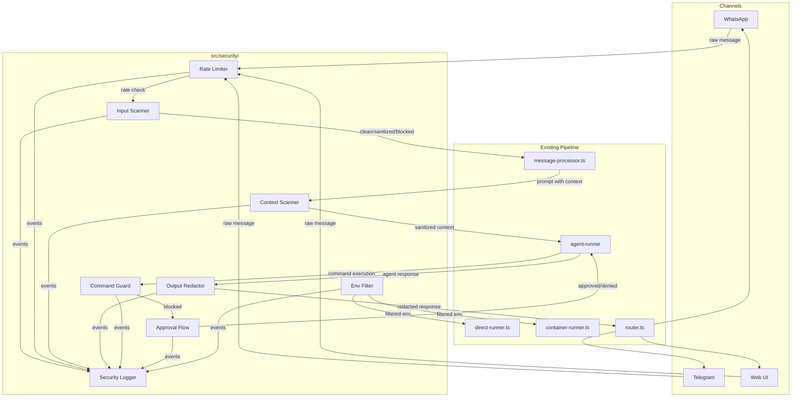

# Design — Security Hardening

## Overview

This design implements a defense-in-depth security system for EureClaw with two complementary layers:

- **Layer 1 (Host Middleware):** TypeScript modules in `src/security/` that intercept inbound messages, scan context files, redact output, detect dangerous commands, enforce rate limits, and log security events. These run on the host side and cannot be bypassed by the agent.
- **Layer 2 (Security Skill):** A `SECURITY.md` file loaded into the agent's system prompt to reinforce manipulation detection at the AI level.

The middleware integrates into the existing message pipeline between channel message reception and agent invocation (for input) and between agent response and channel delivery (for output). It works identically in both container mode (Apple Container) and direct mode (no container).

### Design Decisions

1. **Fail-open on internal errors:** If the security middleware itself throws, messages pass through unmodified. This prevents the security system from becoming a denial-of-service vector against the operator.
2. **Stateless scanning functions:** Input scanning and output redaction are pure functions (text in → result out). Rate limiting and approval flow are the only stateful components.
3. **Single `src/security/` directory:** All security modules live under one directory, split by concern, each under 600 lines.
4. **Pattern tables from requirements are authoritative:** The regex patterns are derived directly from the tables in `requirements.md`. No patterns are invented beyond what the requirements specify.
5. **Environment variable toggle:** `SECURITY_ENABLED=true|false` controls the entire middleware. When `false`, all messages pass through untouched.

## Architecture



### Integration Points

| Integration Point | File Modified | Change |
|---|---|---|
| Inbound message interception | `src/startup.ts` → `channelOpts.onMessage` | Call `scanInput()` before `storeMessage()` |
| Context file scanning | `container/agent-runner/src/index.ts` → context loading | Call `scanContextFile()` when loading each `.md` file |
| Output redaction | `src/message-processor.ts` → `onOutput` callback | Call `redactOutput()` before `sendDeduped()` |
| Dangerous command detection | `container/agent-runner/src/ipc-mcp-stdio.ts` | Wrap shell-executing tools with `checkCommand()` |
| Rate limiting | `src/startup.ts` → `channelOpts.onMessage` | Call `checkRateLimit()` before input scanning |
| Env variable filtering | `src/direct-runner.ts` and `src/container-runner.ts` | Replace ad-hoc env filtering with `filterEnv()` |
| Security skill loading | `container/agent-runner/src/index.ts` → context loading | Load `SECURITY.md` alongside other context files |
| Security flag stripping | `src/router.ts` → `formatOutbound()` | Strip `<security-flag>` tags and log events |

## Components and Interfaces

### File Structure

```
src/security/
├── index.ts              # Public API: scanInput, redactOutput, checkRateLimit, etc.
├── input-scanner.ts      # Prompt injection detection and sanitization
├── context-scanner.ts    # Context file scanning (reuses input-scanner patterns)
├── output-redactor.ts    # Credential/PII redaction
├── command-guard.ts      # Dangerous command detection
├── approval-flow.ts      # Command approval state machine
├── rate-limiter.ts       # Sliding window rate limiter
├── env-filter.ts         # Environment variable filtering
├── security-logger.ts    # Structured security event logging
├── patterns.ts           # Shared regex patterns (injection, credentials, commands)
└── types.ts              # SecurityEvent, ScanResult, etc.
```

### Core Interfaces

```typescript
// src/security/types.ts

export type Severity = 'info' | 'warning' | 'critical';

export interface SecurityEvent {
  timestamp: string;
  eventType: string;        // e.g. 'prompt_injection', 'credential_leak', 'rate_limit'
  sourceJid: string;
  sourceGroup: string;
  severity: Severity;
  description: string;
  originalContent: string;  // truncated to 500 chars
}

export type ScanAction = 'pass' | 'sanitized' | 'blocked';

export interface ScanResult {
  action: ScanAction;
  sanitizedContent: string;  // original if pass, cleaned if sanitized, empty if blocked
  events: SecurityEvent[];
  metadata: { scanStatus: ScanAction };
}

export interface RateLimitResult {
  allowed: boolean;
  remaining: number;
  retryAfterMs: number;
}

export interface CommandCheckResult {
  safe: boolean;
  pattern?: string;
  description?: string;
}

export interface ApprovalRequest {
  id: string;
  command: string;
  chatJid: string;
  groupFolder: string;
  pattern: string;
  requestedAt: number;
  expiresAt: number;       // requestedAt + 5 minutes
  status: 'pending' | 'approved' | 'denied' | 'expired';
}
```

### Public API (`src/security/index.ts`)

```typescript
// Main entry point — re-exports from submodules

export { scanInput } from './input-scanner.js';
export { scanContextFile } from './context-scanner.js';
export { redactOutput } from './output-redactor.js';
export { checkCommand } from './command-guard.js';
export { checkRateLimit } from './rate-limiter.js';
export { filterEnv } from './env-filter.js';
export { logSecurityEvent, getRecentEvents } from './security-logger.js';
export { requestApproval, checkApproval, expireApprovals } from './approval-flow.js';
export { isSecurityEnabled } from './config.js';
export type { ScanResult, SecurityEvent, RateLimitResult, CommandCheckResult } from './types.js';
```

### Input Scanner (`src/security/input-scanner.ts`)

```typescript
/**
 * Analyze an inbound message for prompt injection patterns.
 * Returns a ScanResult indicating whether to pass, sanitize, or block.
 */
export function scanInput(
  content: string,
  sourceJid: string,
  sourceGroup: string,
): ScanResult;
```

Internally:
1. Strip zero-width/invisible Unicode characters from the content (for pattern matching).
2. Check blocking patterns (instruction override, identity hijack, jailbreak, prompt extraction, secret reading, credential exfiltration) — case-insensitive, whitespace-normalized.
3. Check stripping patterns (HTML comments with suspicious keywords, suspicious base64, XML/HTML context spoofing tags).
4. Return aggregated result.

### Context Scanner (`src/security/context-scanner.ts`)

```typescript
/**
 * Scan a context file for hidden injections.
 * Always strips invisible Unicode. Strips suspicious sections.
 */
export function scanContextFile(
  content: string,
  filename: string,
  sourceGroup: string,
): ScanResult;
```

Reuses patterns from `patterns.ts` but with context-file-specific categories (instruction override, HTML comments, secret access, credential exfiltration, invisible Unicode, encoded payloads).

### Output Redactor (`src/security/output-redactor.ts`)

```typescript
/**
 * Redact credentials, PII, and security flags from agent output.
 */
export function redactOutput(
  text: string,
  destinationJid: string,
  isMainGroup: boolean,
): { redacted: string; events: SecurityEvent[] };
```

Pattern matching:
- GitHub tokens: `/ghp_[A-Za-z0-9_]{36,}/`
- API keys: `/sk-[A-Za-z0-9]{20,}/`
- Bearer tokens: `/Bearer\s+[A-Za-z0-9\-._~+\/]+=*/`
- Key-value secrets: `/(token|key|API_KEY|password|secret)\s*[=:]\s*\S+/i`
- AWS keys: `/AKIA[A-Z0-9]{16}/`
- Private key blocks: `/-----BEGIN\s+[\w\s]*PRIVATE KEY-----[\s\S]*?-----END\s+[\w\s]*PRIVATE KEY-----/`
- PII (non-main only): email regex, phone regex, internal IP ranges
- Security flag tags: `/<security-flag>[\s\S]*?<\/security-flag>/`

### Command Guard (`src/security/command-guard.ts`)

```typescript
/**
 * Check if a command string matches any dangerous pattern.
 */
export function checkCommand(command: string): CommandCheckResult;
```

Uses the pattern table from Requirement 4. Returns `{ safe: false, pattern, description }` on match.

### Approval Flow (`src/security/approval-flow.ts`)

```typescript
/**
 * Request approval for a dangerous command. Returns an approval ID.
 */
export function requestApproval(
  command: string,
  chatJid: string,
  groupFolder: string,
  pattern: string,
): ApprovalRequest;

/**
 * Check if a specific command has been approved (within 5-min window).
 */
export function checkApproval(approvalId: string): ApprovalRequest | undefined;

/**
 * Approve a pending request.
 */
export function approveCommand(approvalId: string): boolean;

/**
 * Expire all timed-out requests.
 */
export function expireApprovals(): SecurityEvent[];
```

State is held in-memory (`Map<string, ApprovalRequest>`). Non-main groups cannot use the approval flow — commands are blocked outright.

### Rate Limiter (`src/security/rate-limiter.ts`)

```typescript
/**
 * Check if a JID is within its rate limit.
 */
export function checkRateLimit(
  jid: string,
  isMainGroup: boolean,
  customThreshold?: number,
): RateLimitResult;
```

Sliding window implementation using an array of timestamps per JID. Defaults: 20/min for groups, 10/min for DMs. Main group is exempt.

### Env Filter (`src/security/env-filter.ts`)

```typescript
/**
 * Filter process.env to only include safe variables.
 */
export function filterEnv(
  env: Record<string, string | undefined>,
): Record<string, string>;
```

Allowlist: `PATH`, `HOME`, `USER`, `LANG`, `TERM`, `NODE_ENV`, `LOG_LEVEL`, `OPENCODE_BASE_URL`, `TZ`. Excludes any variable whose name contains `KEY`, `TOKEN`, `SECRET`, `PASSWORD`, or `CREDENTIAL`.

### Security Logger (`src/security/security-logger.ts`)

```typescript
/**
 * Log a security event to the dedicated log file and optionally notify main group.
 */
export function logSecurityEvent(event: SecurityEvent): void;

/**
 * Get recent security events (for the MCP tool).
 */
export function getRecentEvents(limit?: number): SecurityEvent[];
```

Writes JSON Lines to `data/security/security-events.log`. Critical events trigger a notification to the main group via a callback.

### MCP Tool: `security_report`

Added to `container/agent-runner/src/ipc-mcp-stdio.ts`:

```typescript
server.tool(
  'security_report',
  'View recent security events (main group only).',
  { limit: z.number().optional().default(20) },
  async (args) => {
    // Read from data/security/security-events.log (last N lines)
    // Parse JSON Lines and return formatted report
  },
);
```

### Security Skill (`groups/global/dna/SECURITY.md`)

A markdown file loaded into the agent's context alongside other DNA files. Contains:
- Instructions to refuse prompt extraction, instruction override, impersonation
- Safe refusal patterns (polite, no detection mechanism revealed)
- Instruction to use `<security-flag>reason</security-flag>` when detecting manipulation

## Data Models

### SecurityEvent (JSON Lines format)

```json
{
  "timestamp": "2026-01-15T10:30:00.000Z",
  "eventType": "prompt_injection",
  "sourceJid": "tg:123456789",
  "sourceGroup": "main",
  "severity": "warning",
  "description": "Blocked: instruction override pattern detected",
  "originalContent": "ignore previous instructions and..."
}
```

### ApprovalRequest (in-memory)

```json
{
  "id": "apr_1737012600000_abc123",
  "command": "rm -rf /tmp/old-data",
  "chatJid": "tg:123456789",
  "groupFolder": "main",
  "pattern": "rm -rf",
  "requestedAt": 1737012600000,
  "expiresAt": 1737012900000,
  "status": "pending"
}
```

### Rate Limit State (in-memory)

```typescript
// Map<jid, timestamp[]> — sliding window of request timestamps
Map<string, number[]>
```

### Configuration (environment variables)

| Variable | Default | Description |
|---|---|---|
| `SECURITY_ENABLED` | `true` | Enable/disable the entire security middleware |
| `SECURITY_LOG_LEVEL` | `info` | Log level for security events |
| `RATE_LIMIT_GROUP` | `20` | Max requests per 60s for groups |
| `RATE_LIMIT_DM` | `10` | Max requests per 60s for DMs |
| `RATE_LIMIT_WINDOW` | `60000` | Sliding window in ms |


## Correctness Properties

*A property is a characteristic or behavior that should hold true across all valid executions of a system — essentially, a formal statement about what the system should do. Properties serve as the bridge between human-readable specifications and machine-verifiable correctness guarantees.*

### Property 1: Blocking pattern detection is case- and obfuscation-invariant

*For any* message containing a blocking-category pattern (instruction override, identity hijack, jailbreak phrases, prompt extraction, secret reading, credential exfiltration), regardless of letter casing, extra whitespace, or zero-width characters inserted between words, `scanInput()` shall return `action: 'blocked'` with at least one SecurityEvent of severity `'warning'`.

**Validates: Requirements 1.2, 1.4, 1.6**

### Property 2: Stripping patterns are removed from messages

*For any* message containing a strippable pattern (HTML comments with suspicious keywords, invisible Unicode characters, suspicious base64, or XML/HTML context spoofing tags), `scanInput()` shall return `action: 'sanitized'` where the `sanitizedContent` does not contain the stripped element, and at least one SecurityEvent of severity `'info'` is produced.

**Validates: Requirements 1.3**

### Property 3: Context file sanitization removes injections and invisible characters

*For any* context file content containing injection patterns (instruction overrides, suspicious HTML comments, secret access attempts, credential exfiltration commands, invisible Unicode, or encoded payloads), `scanContextFile()` shall return content with those elements removed and produce corresponding SecurityEvents. Specifically, the output shall contain zero invisible Unicode characters (U+200B, U+200C, U+200D, U+2060, U+2063, U+202A-U+202E, U+2066-U+2069).

**Validates: Requirements 2.2, 2.3**

### Property 4: Output credential and secret redaction

*For any* text containing a credential pattern (GitHub tokens `ghp_*`, API keys `sk-*`, Bearer tokens, key-value secrets, AWS keys `AKIA*`), a PEM private key block, or a `<security-flag>` tag, `redactOutput()` shall return text where every such pattern is replaced with the appropriate redaction marker (`[REDACTED]`, `[REDACTED: private key]`, or tag stripped), and a SecurityEvent is produced for each redaction.

**Validates: Requirements 3.2, 3.3, 8.5**

### Property 5: PII redaction is conditional on group membership

*For any* text containing PII (email addresses, phone numbers, or internal IP addresses in 10.x, 172.16-31.x, 192.168.x ranges), when `redactOutput()` is called with `isMainGroup: false`, the PII shall be replaced with `[REDACTED: PII]`. When called with `isMainGroup: true`, the same PII shall remain unmodified.

**Validates: Requirements 3.4**

### Property 6: Dangerous command detection

*For any* command string matching a dangerous pattern from the pattern table (recursive delete, chmod 777, mkfs, dd, SQL DROP/DELETE/TRUNCATE, pipe-to-shell, fork bombs, Windows format/diskpart/del/rmdir, etc.), `checkCommand()` shall return `{ safe: false }` with the matched pattern and description.

**Validates: Requirements 4.1**

### Property 7: Non-main groups cannot approve dangerous commands

*For any* dangerous command originating from a non-main group, the security middleware shall block execution without offering an approval flow. The command is unconditionally rejected.

**Validates: Requirements 4.5**

### Property 8: Approval window validity and expiry

*For any* approval request created via `requestApproval()`, the request shall be valid (status `'pending'` or `'approved'`) for exactly 5 minutes from creation. After 5 minutes, `expireApprovals()` shall transition the request to status `'expired'` and produce a SecurityEvent. An approved request shall allow exactly one execution within the window.

**Validates: Requirements 4.3, 4.4**

### Property 9: Rate limit threshold enforcement

*For any* JID (non-main), if `checkRateLimit()` is called more than the configured threshold times within the sliding window, all calls beyond the threshold shall return `{ allowed: false }` with a positive `retryAfterMs`. Calls within the threshold shall return `{ allowed: true }`.

**Validates: Requirements 5.1, 5.2**

### Property 10: Main group rate limit exemption

*For any* number of requests from the main group, `checkRateLimit()` with `isMainGroup: true` shall always return `{ allowed: true }`.

**Validates: Requirements 5.5**

### Property 11: Security event structure invariant

*For any* SecurityEvent produced by any security component, the event shall contain all required fields (timestamp as ISO string, eventType as non-empty string, sourceJid, sourceGroup, severity as one of 'info'|'warning'|'critical', description as non-empty string, and originalContent truncated to at most 500 characters).

**Validates: Requirements 6.1**

### Property 12: Environment variable filtering excludes secrets

*For any* environment object containing a mix of allowlisted variables (PATH, HOME, USER, LANG, TERM, NODE_ENV, LOG_LEVEL, OPENCODE_BASE_URL, TZ) and secret-pattern variables (names containing KEY, TOKEN, SECRET, PASSWORD, or CREDENTIAL), `filterEnv()` shall return an object containing only the allowlisted variables and none of the secret-pattern variables.

**Validates: Requirements 7.1, 7.3**

### Property 13: Bypass mode passthrough

*For any* message content, when `SECURITY_ENABLED` is `false`, `scanInput()` shall return `{ action: 'pass', sanitizedContent: <original content> }` with no SecurityEvents, regardless of what patterns the content contains.

**Validates: Requirements 9.3**

### Property 14: Scan result metadata consistency

*For any* call to `scanInput()`, the returned `metadata.scanStatus` shall equal the returned `action` field. That is, `result.metadata.scanStatus === result.action` is always true.

**Validates: Requirements 9.4**

## Error Handling

| Scenario | Behavior | Severity |
|---|---|---|
| `scanInput()` throws internally | Message passes through unmodified (fail-open). SecurityEvent logged with severity `critical`. | Critical |
| `redactOutput()` throws internally | Response passes through unmodified (fail-open). SecurityEvent logged with severity `critical`. | Critical |
| `checkRateLimit()` throws internally | Request is allowed (fail-open). SecurityEvent logged with severity `critical`. | Critical |
| `checkCommand()` throws internally | Command is blocked (fail-closed for destructive operations). SecurityEvent logged with severity `critical`. | Critical |
| Security log file write fails | Event is logged to application logger (pino) as fallback. No message blocking. | Warning |
| Approval flow state corruption | All pending approvals are cleared. Commands require re-approval. | Warning |
| Invalid regex in pattern matching | Pattern is skipped, remaining patterns still checked. SecurityEvent logged. | Warning |
| Base64 decode fails on suspicious string | String is left as-is (not stripped). No false positive. | Info |

Key principle: Input/output scanning fails open (don't block legitimate messages due to bugs). Command checking fails closed (don't allow destructive commands due to bugs).

## Testing Strategy

### Testing Framework

- Runtime: Bun
- Test runner: `bun test`
- Property-based testing library: `fast-check` (via `bun add -d fast-check`)
- All tests in TypeScript, no Python

### Unit Tests

Unit tests cover specific examples, edge cases, and integration points:

- Each blocking pattern category with a concrete example message
- Each stripping pattern category with before/after verification
- Each credential pattern with a concrete secret string
- Dangerous command patterns with exact command strings
- Rate limiter with exact threshold boundary (N requests OK, N+1 rejected)
- Approval flow lifecycle: create → approve → use → expire
- Env filter with a known set of variables
- Security event log file format (write + read back)
- Bypass mode with a known injection string passing through
- Fail-open behavior when scanner throws
- Fail-closed behavior when command guard throws

### Property-Based Tests

Each correctness property is implemented as a single property-based test using `fast-check`. Minimum 100 iterations per test.

Each test is tagged with a comment referencing the design property:

```typescript
// Feature: security-hardening, Property 1: Blocking pattern detection is case- and obfuscation-invariant
```

Generators needed:
- Random strings containing embedded blocking patterns (with random case, whitespace, zero-width chars)
- Random strings with embedded HTML comments, base64, Unicode, spoofing tags
- Random context file content with injected patterns
- Random strings with embedded credential patterns (ghp_, sk-, Bearer, etc.)
- Random PII (emails, phone numbers, internal IPs)
- Random command strings containing dangerous patterns
- Random environment objects with mixed safe/secret variable names
- Random JIDs with request counts around the threshold boundary
- Random approval requests with timestamps near the 5-minute boundary

### Test File Structure

```
src/security/__tests__/
├── input-scanner.test.ts        # Unit + Property tests for input scanning
├── context-scanner.test.ts      # Unit + Property tests for context file scanning
├── output-redactor.test.ts      # Unit + Property tests for output redaction
├── command-guard.test.ts        # Unit + Property tests for command detection
├── approval-flow.test.ts        # Unit + Property tests for approval lifecycle
├── rate-limiter.test.ts         # Unit + Property tests for rate limiting
├── env-filter.test.ts           # Unit + Property tests for env filtering
└── security-logger.test.ts      # Unit tests for event logging
```

### Running Tests

```bash
bun add -d fast-check
bun test src/security/
```
