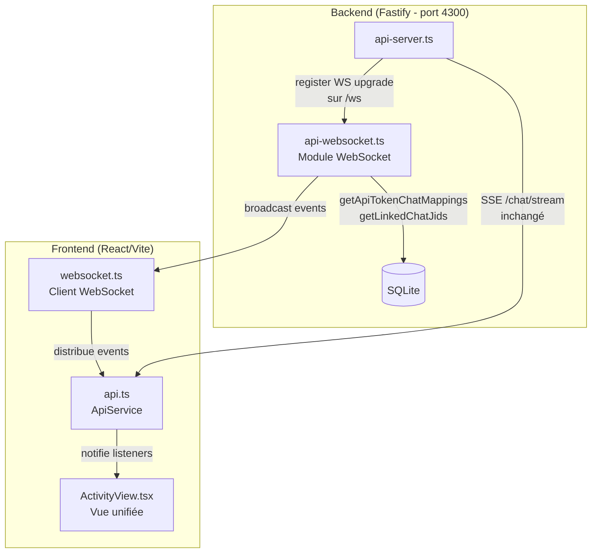
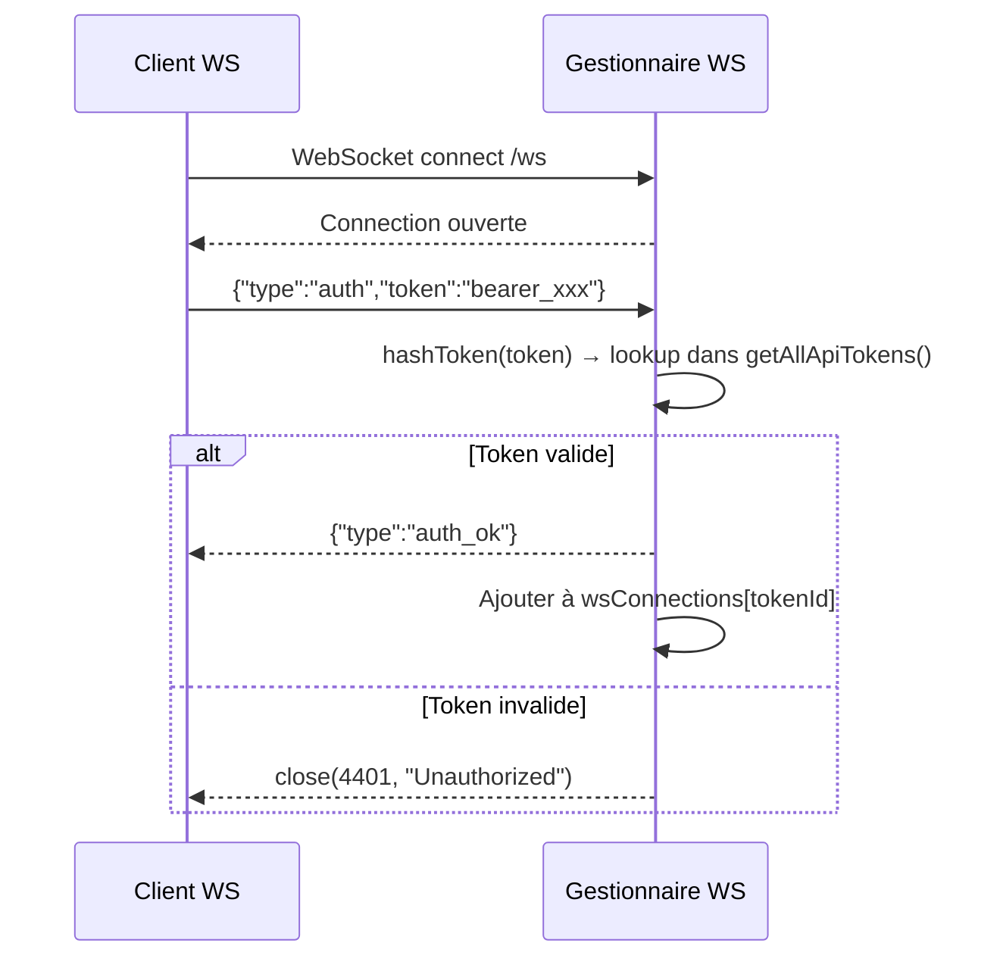
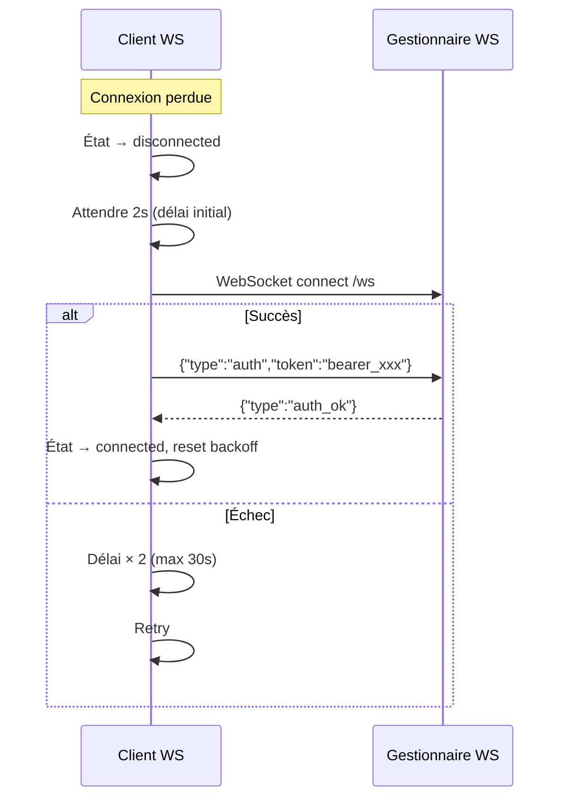

# Design Technique — Migration WebSocket du Panneau de Contrôle

## Vue d'ensemble

Cette migration remplace le transport SSE (`/events`) du panneau de contrôle par WebSocket pour les événements temps réel (messages, statuts, étapes d'exécution), tout en conservant le SSE `/chat/stream` pour le streaming de tokens du modèle. En parallèle, les trois sections Trace, Debug et Logs sont fusionnées en une vue unifiée « Activity ».

Le design introduit deux nouveaux modules :
- **`src/api-websocket.ts`** (serveur) — gestion des connexions WS, authentification, heartbeat, diffusion
- **`web-ui/src/websocket.ts`** (client) — connexion, reconnexion avec backoff exponentiel, authentification, distribution d'événements

L'intégration se fait par remplacement des fonctions `broadcastToToken`, `broadcastStatus`, `broadcastStep` dans `api-server.ts` par des appels au module WebSocket, et par remplacement de `connectToEvents()` dans `ApiService` par le client WS.

### Décisions de design clés

1. **Authentification par premier message** : Le token Bearer est envoyé dans le premier message JSON `{"type":"auth","token":"..."}` plutôt que via query string (évite l'exposition du token dans les logs serveur/proxy).
2. **Module séparé** : Le code WS est isolé dans des fichiers dédiés pour respecter la limite de 600 lignes et la séparation des responsabilités.
3. **Remplacement progressif** : Les fonctions de broadcast exportées gardent la même signature, permettant un remplacement transparent dans les modules existants.
4. **Vue Activity** : Fusion des trois composants en un seul avec timeline verticale (style Trace), metadata agent (style Debug) et résumé d'erreurs (style Logs).

## Architecture



### Flux d'authentification WebSocket



### Flux de reconnexion client



## Composants et Interfaces

### 1. Module serveur WebSocket (`src/api-websocket.ts`)

```typescript
// Types internes
interface WsClient {
  ws: WebSocket;
  tokenId: string;
  authenticated: boolean;
  lastPong: number;
}

// API publique exportée
export function setupWebSocket(fastify: FastifyInstance): void;
export function broadcastToToken(chatJid: string, message: BroadcastMessage): void;
export function broadcastStatus(chatJid: string, status: StatusType, detail?: string): void;
export function broadcastStep(chatJid: string, executionId: string, step: StepPayload): void;
export function getWsConnectionCount(): number;
```

**Responsabilités :**
- Enregistrer le handler d'upgrade WebSocket sur `/ws` via `fastify.server`
- Gérer l'authentification par premier message (hash SHA-256, lookup dans `getAllApiTokens()`)
- Maintenir une `Map<string, Set<WsClient>>` indexée par `tokenId`
- Heartbeat : ping toutes les 30s, timeout pong à 10s → fermeture connexion morte
- Limiter à 50 connexions par `tokenId`
- Diffuser les événements en respectant les mappings de chats (`getApiTokenChatMappings`) et les JIDs liés (`getLinkedChatJids`)
- Répondre aux messages `{"type":"ping"}` avec `{"type":"pong"}`
- Ignorer les messages JSON malformés sans fermer la connexion

### 2. Module client WebSocket (`web-ui/src/websocket.ts`)

```typescript
export interface WsConnectionStatus {
  connected: boolean;
  reconnecting: boolean;
  reconnectAttempt: number;
}

export type WsEventCallback = (data: any) => void;

export class WebSocketClient {
  constructor(baseUrl: string);
  
  connect(token: string): void;
  disconnect(): void;
  
  onMessage(callback: (message: Message) => void): () => void;
  onStatus(callback: (event: StatusEvent) => void): () => void;
  onStep(callback: (event: StepEvent) => void): () => void;
  onConnectionChange(callback: (status: WsConnectionStatus) => void): () => void;
  
  sendPing(): void;
  
  get isConnected(): boolean;
}
```

**Responsabilités :**
- Établir la connexion WebSocket vers `ws://host:4300/ws`
- Envoyer le message d'authentification après ouverture
- Reconnexion automatique avec backoff exponentiel (2s initial, ×2, max 30s)
- Distribuer les événements reçus aux listeners enregistrés (message, status, step)
- Exposer l'état de connexion (connected, reconnecting, attempt count)
- Répondre automatiquement aux pongs (natif WebSocket)

### 3. Intégration dans `api-server.ts`

Modifications minimales :
- Importer et appeler `setupWebSocket(fastify)` avant `fastify.listen()`
- Remplacer les imports locaux de `broadcastToToken`, `broadcastStatus`, `broadcastStep` par les exports du module WS
- Supprimer la `Map sseConnections` et l'endpoint `/events`
- Conserver l'export des fonctions broadcast (re-export depuis le module WS) pour compatibilité avec les autres modules (`src/index.ts`, etc.)

### 4. Intégration dans `api.ts` (ApiService)

Modifications minimales :
- Instancier `WebSocketClient` dans le constructeur
- Remplacer `connectToEvents()` par `wsClient.connect(token)`
- Remplacer `disconnectFromEvents()` par `wsClient.disconnect()`
- Adapter `onConnectionChange` pour mapper `WsConnectionStatus` vers `ConnectionStatus` existant (le champ `sseConnected` devient `wsConnected` mais l'interface publique reste compatible)
- Les méthodes `onMessage()` et `onStatus()` délèguent au `WebSocketClient`

### 5. Vue Activity (`web-ui/src/settings/ActivityView.tsx`)

```typescript
interface ActivityViewProps {
  executions: AgentExecution[];
  activeExecutions: AgentExecution[];
  onRefresh: () => void;
  isDark: boolean;
}
```

**Structure de la vue :**
1. **Résumé d'erreurs** (en haut) — panneau rose avec les erreurs récentes (repris de LogsSection)
2. **Toggles de filtrage** — « All » | « Errors » | « Active » (boutons toggle)
3. **Timeline verticale** — liste d'exécutions avec :
   - Dot coloré + ligne pointillée (style StepTimeline de ExecutionTrace)
   - Nom du workspace + type d'agent (`agentType`) affiché à côté
   - Metadata : modèle, session, durée (repris de DebugSection)
   - Erreur éventuelle en rouge
   - Expansion pour voir les steps détaillés
4. **Bouton Refresh** + auto-refresh des exécutions actives (polling 2s)
5. **Mises à jour temps réel** via WebSocket (événements `step`)

### 6. Navigation (`SettingsNav.tsx` et `AdminPage.tsx`)

- Remplacer les trois entrées `trace`, `debug`, `logs` par une seule entrée `activity` dans le groupe « Agent »
- Le type `SettingsSection` perd `'trace' | 'debug' | 'logs'` et gagne `'activity'`
- `AdminPage.tsx` rend `<ActivityView>` pour `section === 'activity'`

## Modèles de Données

### Messages WebSocket (serveur → client)

```typescript
// Authentification réussie
{ type: "auth_ok" }

// Événement message (identique au format SSE actuel)
{ type: "message", chatJid: string, id: string, content: string, 
  sender_name: string, timestamp: string, is_from_me: boolean, 
  is_bot_message: boolean, metadata?: Record<string, unknown> }

// Événement statut (identique au format SSE actuel)
{ type: "status", chatJid: string, 
  status: "processing" | "connecting" | "waiting" | "responding" | "error" | "done" | "queued",
  detail?: string, timestamp: string }

// Événement étape (identique au format SSE actuel)
{ type: "step", chatJid: string, executionId: string,
  step: { timestamp: string, phase: string, message: string, metadata?: Record<string, unknown> },
  timestamp: string }

// Pong applicatif
{ type: "pong", timestamp: string }
```

### Messages WebSocket (client → serveur)

```typescript
// Authentification
{ type: "auth", token: string }

// Ping applicatif
{ type: "ping" }
```

### Structure de connexion côté serveur

```typescript
// Map principale : tokenId → Set de clients WS
const wsConnections: Map<string, Set<WsClient>> = new Map();

interface WsClient {
  ws: WebSocket;           // Instance WebSocket native
  tokenId: string;         // ID du token après auth
  authenticated: boolean;  // true après auth_ok
  lastPong: number;        // Date.now() du dernier pong reçu
}
```

### État de connexion côté client

```typescript
interface WsState {
  socket: WebSocket | null;
  token: string;
  connected: boolean;
  authenticated: boolean;
  reconnectAttempt: number;
  reconnectDelay: number;    // 2000ms initial
  maxReconnectDelay: number; // 30000ms
  reconnectTimer: ReturnType<typeof setTimeout> | null;
}
```


## Propriétés de Correction

*Une propriété est une caractéristique ou un comportement qui doit rester vrai pour toutes les exécutions valides d'un système — essentiellement, une déclaration formelle de ce que le système doit faire. Les propriétés servent de pont entre les spécifications lisibles par l'humain et les garanties de correction vérifiables par la machine.*

### Property 1: Authentification valide acceptée

*Pour tout* token API valide (existant dans la base, actif, correctement hashé), lorsque le client envoie un message `{"type":"auth","token":"<token>"}` sur la connexion WebSocket, le serveur doit répondre avec `{"type":"auth_ok"}` et la connexion doit rester ouverte.

**Validates: Requirements 1.1, 1.4**

### Property 2: Authentification invalide rejetée avec code 4401

*Pour tout* token invalide (inexistant, désactivé, vide, ou malformé), lorsque le client envoie un message d'authentification, le serveur doit fermer la connexion avec le code de fermeture 4401.

**Validates: Requirements 1.2, 1.5**

### Property 3: Diffusion filtrée par autorisation

*Pour tout* événement (message, status, ou step) diffusé pour un chatJid donné, et *pour tout* ensemble de clients WebSocket authentifiés avec des mappings de chats différents, seuls les clients dont le tokenId a accès au chatJid concerné (via `getApiTokenChatMappings`) doivent recevoir l'événement. Les clients sans mapping (mappings vides = accès à tout) doivent aussi recevoir l'événement.

**Validates: Requirements 2.1, 2.2, 2.3, 2.5**

### Property 4: Compatibilité du format d'événements

*Pour tout* événement généré par les fonctions de broadcast (message, status, step), le JSON produit par le module WebSocket doit contenir exactement les mêmes champs (`type`, `chatJid`, `status`, `detail`, `timestamp`, etc.) que celui produit par l'ancien système SSE.

**Validates: Requirements 2.4**

### Property 5: Diffusion cross-canal via JIDs liés

*Pour tout* chatJid ayant des JIDs liés (via `getLinkedChatJids`), lorsqu'un événement est diffusé pour ce chatJid, les clients WebSocket authentifiés qui ont accès à n'importe lequel des JIDs liés doivent aussi recevoir l'événement.

**Validates: Requirements 2.6**

### Property 6: Backoff exponentiel de reconnexion

*Pour tout* nombre de tentatives de reconnexion consécutives échouées `n` (n ≥ 0), le délai avant la prochaine tentative doit être `min(2000 * 2^n, 30000)` millisecondes.

**Validates: Requirements 3.2**

### Property 7: Cohérence de l'état de connexion client

*Pour tout* changement d'état de la connexion WebSocket (ouverture, fermeture, erreur), l'état exposé par `WsConnectionStatus` doit refléter fidèlement l'état réel : `connected=true` uniquement quand la connexion est ouverte et authentifiée, `reconnecting=true` uniquement pendant les tentatives de reconnexion.

**Validates: Requirements 3.3**

### Property 8: Ping applicatif → Pong

*Pour tout* message `{"type":"ping"}` envoyé par un client authentifié, le serveur doit répondre avec un message `{"type":"pong","timestamp":"..."}` contenant un timestamp ISO valide.

**Validates: Requirements 6.1**

### Property 9: Résilience aux messages malformés

*Pour toute* chaîne de caractères qui n'est pas du JSON valide, ou du JSON valide mais avec un `type` inconnu, envoyée par un client authentifié, la connexion WebSocket doit rester ouverte et fonctionnelle.

**Validates: Requirements 6.2**

### Property 10: Nettoyage après erreur d'envoi

*Pour tout* client WebSocket dont l'envoi de message échoue (erreur réseau, socket fermé), le serveur doit retirer ce client de la `Map wsConnections` et fermer la connexion. Après le nettoyage, le nombre de connexions pour ce tokenId doit diminuer de 1.

**Validates: Requirements 7.1**

### Property 11: Libération des ressources après déconnexion

*Pour tout* client WebSocket qui se déconnecte (fermeture normale ou anormale), le serveur doit retirer le client de `wsConnections` et le client ne doit plus apparaître dans aucune structure de données du serveur.

**Validates: Requirements 7.3**

### Property 12: Limite de connexions par token

*Pour tout* tokenId, le nombre de connexions WebSocket simultanées ne doit jamais dépasser 50. Toute tentative de connexion au-delà de cette limite doit être rejetée.

**Validates: Requirements 7.4**

### Property 13: Affichage des metadata d'exécution

*Pour toute* exécution `AgentExecution` avec des champs `agentType`, `model`, `duration` et optionnellement `sessionId` et `error`, le rendu de la Vue_Activity doit contenir chacune de ces informations visiblement, incluant le nom de l'agent (`agentType`) à côté du nom du workspace.

**Validates: Requirements 9.3, 9.4**

### Property 14: Résumé des erreurs

*Pour tout* ensemble d'exécutions contenant au moins une exécution avec `status === 'error'`, la Vue_Activity doit afficher un panneau de résumé d'erreurs en haut de la vue contenant le nombre d'erreurs et les détails de chaque erreur.

**Validates: Requirements 9.5**

### Property 15: Filtrage par catégorie

*Pour tout* ensemble d'exécutions et *pour tout* filtre sélectionné parmi « All », « Errors », « Active » :
- « All » affiche toutes les exécutions
- « Errors » affiche uniquement les exécutions avec `status === 'error'`
- « Active » affiche uniquement les exécutions avec `status === 'started' || status === 'running'`

**Validates: Requirements 9.6**

## Gestion des Erreurs

### Côté serveur (`api-websocket.ts`)

| Scénario | Comportement |
|----------|-------------|
| Token invalide à l'auth | Fermer la connexion avec code 4401 et message "Unauthorized" |
| Message JSON malformé | Logger un warning, ignorer le message, garder la connexion ouverte |
| Erreur d'envoi à un client | Fermer la connexion du client, le retirer de `wsConnections`, logger l'erreur |
| Timeout pong (>10s) | Fermer la connexion, retirer de `wsConnections` |
| Limite de 50 connexions atteinte | Fermer la nouvelle connexion avec code 4429 et message "Too many connections" |
| Échec de démarrage du module WS | Logger l'erreur, le serveur Fastify continue sans WebSocket |
| Exception non gérée dans un handler | Try/catch global, logger l'erreur, fermer la connexion concernée |

### Côté client (`websocket.ts`)

| Scénario | Comportement |
|----------|-------------|
| Connexion refusée | Déclencher la reconnexion avec backoff |
| Auth rejetée (code 4401) | Ne pas tenter de reconnexion (token invalide), notifier via `onConnectionChange` |
| Connexion perdue | Mettre à jour l'état, déclencher la reconnexion avec backoff |
| Message JSON malformé reçu | Logger un warning, ignorer le message |
| Erreur WebSocket | Logger l'erreur, déclencher la reconnexion |

### Codes de fermeture WebSocket personnalisés

| Code | Signification |
|------|--------------|
| 4401 | Non autorisé (token invalide ou absent) |
| 4429 | Trop de connexions pour ce token |

## Stratégie de Tests

### Approche duale

Les tests combinent deux approches complémentaires :
- **Tests unitaires** : exemples spécifiques, cas limites, conditions d'erreur
- **Tests de propriétés (PBT)** : propriétés universelles vérifiées sur des entrées générées aléatoirement

### Bibliothèque PBT

Utiliser **fast-check** (`bun add -d fast-check`) pour les tests de propriétés côté TypeScript. Chaque test de propriété doit exécuter au minimum 100 itérations.

### Tagging des tests de propriétés

Chaque test de propriété doit être annoté avec un commentaire référençant la propriété du design :

```typescript
// Feature: websocket-control-panel, Property 1: Authentification valide acceptée
```

### Tests unitaires (exemples et cas limites)

| Test | Type | Couvre |
|------|------|--------|
| Connexion WS avec token valide → auth_ok | Exemple | Req 1.1, 1.3, 1.4 |
| Reconnexion automatique après déconnexion (délai 2s) | Exemple | Req 3.1 |
| Ré-authentification après reconnexion | Exemple | Req 3.4 |
| Timeout pong → fermeture connexion | Exemple | Req 4.2 |
| Endpoint `/chat/stream` toujours fonctionnel | Exemple | Req 5.3 |
| Endpoint `/events` retourne 404 | Exemple | Req 5.4 |
| Échec démarrage WS → serveur continue | Exemple | Req 7.2 |
| Navigation contient "Activity" et pas "Trace"/"Debug"/"Logs" | Exemple | Req 9.1 |

### Tests de propriétés (PBT)

Chaque propriété de correction (Property 1-15) doit être implémentée par un **seul** test de propriété fast-check.

| Property | Générateurs nécessaires |
|----------|------------------------|
| P1: Auth valide | Générateur de tokens valides (hex 32 chars) |
| P2: Auth invalide | Générateur de strings arbitraires (vides, non-hex, tronqués) |
| P3: Broadcast filtré | Générateur de (événement, liste de clients avec mappings variés) |
| P4: Format compatible | Générateur d'événements (message, status, step) avec champs aléatoires |
| P5: JIDs liés | Générateur de graphes de JIDs liés + événements |
| P6: Backoff | Générateur d'entiers n ∈ [0, 20] pour le nombre de tentatives |
| P7: État connexion | Générateur de séquences d'événements (open, close, error) |
| P8: Ping/pong | Générateur de messages ping (toujours le même format) |
| P9: Messages malformés | Générateur de strings arbitraires (non-JSON, JSON invalide, types inconnus) |
| P10: Erreur d'envoi | Générateur de (client, message) avec simulation d'erreur |
| P11: Déconnexion | Générateur de clients avec tokenIds variés |
| P12: Limite connexions | Générateur d'entiers n ∈ [1, 100] pour le nombre de connexions |
| P13: Metadata exécution | Générateur d'`AgentExecution` avec champs aléatoires |
| P14: Résumé erreurs | Générateur de listes d'`AgentExecution` avec mix de statuts |
| P15: Filtrage | Générateur de (liste d'exécutions, filtre sélectionné) |

### Organisation des fichiers de test

```
src/__tests__/api-websocket.test.ts          — Tests serveur WS (P1-P5, P8-P12)
web-ui/src/__tests__/websocket.test.ts       — Tests client WS (P6, P7)
web-ui/src/__tests__/ActivityView.test.ts    — Tests vue Activity (P13-P15)
```
